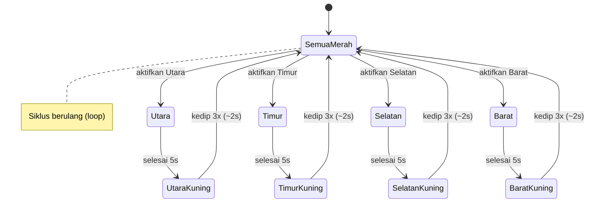

# Traffic Light 4 Arah - Dokumentasi & Desain

**Deskripsi Singkat**
- **Tujuan**: Sistem lampu lalu lintas empat arah berbasis Arduino Uno yang mengatur giliran lampu hijau searah jarum jam (Utara → Timur → Selatan → Barat) dengan transisi kuning berkedip sebelum kembali merah.

**Komponen**
- **Arduino**: Arduino Uno
- **LED**: 4 set x 3 warna (Merah, Kuning, Hijau) — total 12 LED
- **Resistor**: 220 Ω (x12)
- **Breadboard** dan kabel jumper
- **Sumber daya**: Kabel USB untuk Arduino / catu daya yang sesuai

**Pemetaan Pin (kode)**
- **Barat**: Merah = 2, Kuning = 3, Hijau = 4
- **Timur**: Merah = 5, Kuning = 6, Hijau = 7
- **Selatan**: Merah = 8, Kuning = 9, Hijau = 10
- **Utara**: Merah = 11, Kuning = 12, Hijau = 13

Kode utama ada di: [traffic_light_4_arah1.ino](traffic_light_4_arah1.ino)

**Logika Operasi (ringkasan)**
- **Kondisi awal**: Semua lampu merah menyala (kondisi aman).
- **Urutan hijau**: Menyala bergiliran searah jarum jam — Utara → Timur → Selatan → Barat.
- **Durasi hijau**: 5 detik per arah.
- **Transisi**: Sebelum hijau berubah ke merah, lampu kuning berkedip 3 kali (~2 detik total) sebagai peringatan.
- **Penjamin keselamatan**: Sistem hanya menyalakan satu lampu hijau pada satu waktu.

**Diagram State Machine (Mermaid)**

**Skema Koneksi (petunjuk)**
- Sambungkan setiap LED melalui resistor 220 Ω ke pin Arduino sesuai pemetaan di atas.
- Terminal katoda LED dihubungkan ke GND (gunakan rail GND pada breadboard).
- Pastikan resistor dipasang di seri dengan anoda LED untuk membatasi arus.

Contoh singkat (arah Utara):
- Anoda LED Merah Utara → pin 11 → resistor 220Ω → LED → katoda → GND
- Anoda LED Kuning Utara → pin 12 → resistor 220Ω → LED → katoda → GND
- Anoda LED Hijau Utara → pin 13 → resistor 220Ω → LED → katoda → GND

**Gambar Wiring**

**Hasil Simulasi (Tinkercad)**
- Berdasarkan hasil simulasi yang dilakukan menggunakan Tinkercad, sistem traffic light empat arah berbasis Arduino Uno dapat berjalan sesuai dengan ketentuan yang telah ditetapkan. Pada kondisi awal, seluruh lampu lalu lintas berada dalam keadaan merah sebagai kondisi aman sebelum satu arah diaktifkan.
- Lampu hijau menyala secara bergiliran searah jarum jam, dimulai dari arah utara, kemudian berpindah ke arah timur, selatan, dan barat. Setiap lampu hijau menyala selama 5 detik, memberikan waktu yang cukup bagi kendaraan untuk melintas pada satu arah tertentu, sementara arah lainnya tetap berada dalam kondisi merah.
- Sebelum lampu hijau berubah menjadi merah, sistem memberikan transisi berupa lampu kuning yang berkedip sebanyak tiga kali dengan total durasi sekitar dua detik. Efek kedip ini berfungsi sebagai peringatan visual bagi pengguna jalan bahwa fase lampu akan segera berubah. Setelah fase kuning selesai, lampu merah kembali menyala pada arah tersebut.
- Hasil simulasi menunjukkan bahwa sistem tidak pernah menyalakan lebih dari satu lampu hijau secara bersamaan, sehingga konflik antar arah dapat dihindari. Sistem juga berjalan secara terus-menerus melalui fungsi perulangan (`loop`), yang menandakan bahwa logika program telah dirancang dengan baik dan sesuai dengan prinsip dasar sistem tertanam.

**Pengujian di Tinkercad**
- Bangun rangkaian sesuai pemetaan pin di editor Tinkercad.
- Lampu harus mengikuti urutan Utara → Timur → Selatan → Barat.
- Periksa bahwa kuning berkedip 3x sebelum merah menyala kembali.

